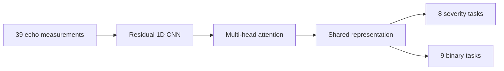
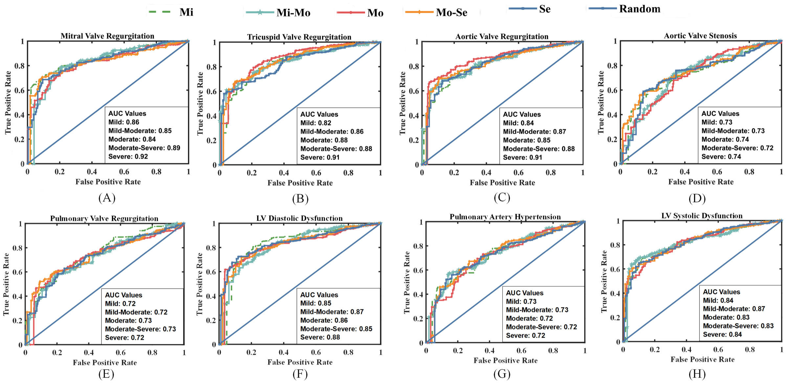

<div align="center">

# DeepCard

**Standardized multi-task interpretation of multiparameter cardiac ultrasound**

[](https://doi.org/10.1016/j.isci.2026.116904)
[](https://doi.org/10.1016/j.isci.2026.116904)
[](DeepCard)

</div>

DeepCard jointly interprets 39 quantitative echocardiographic measurements across 17 diagnostic tasks with external validation.

## Architecture



## Results

| Valvular specificity | Ventricular accuracy | External performance drop |
|:---:|:---:|:---:|
| **91%** | **82%** | **2.6%** |

<p align="center">
  
</p>

## Repository layout

```text
Deepcard/
├── assets/                 # result figures
├── DeepCard/
│   ├── model.py            # multi-task network
│   ├── train.py            # stratified training pipeline
│   ├── evaluate.py         # internal and external evaluation
│   ├── interpret.py        # SHAP interpretation
│   ├── DATA_FORMAT.md      # privacy-safe input schema
│   └── requirements.txt
└── README.md
```

<details>
<summary><b>Citation</b></summary>

```bibtex
@article{wen2026deepcard,
  title   = {A Deep Learning Framework for Standardized Interpretation of Multiparameter Cardiac Ultrasound and Disease Classification},
  author  = {Wen, Zhihong and Liu, Xiangpeng and Liu, Yi and Tang, Wenbo and An, Kang and Guo, Shengli},
  journal = {iScience},
  volume  = {29},
  number  = {8},
  pages   = {116904},
  year    = {2026},
  doi     = {10.1016/j.isci.2026.116904}
}
```

</details>
