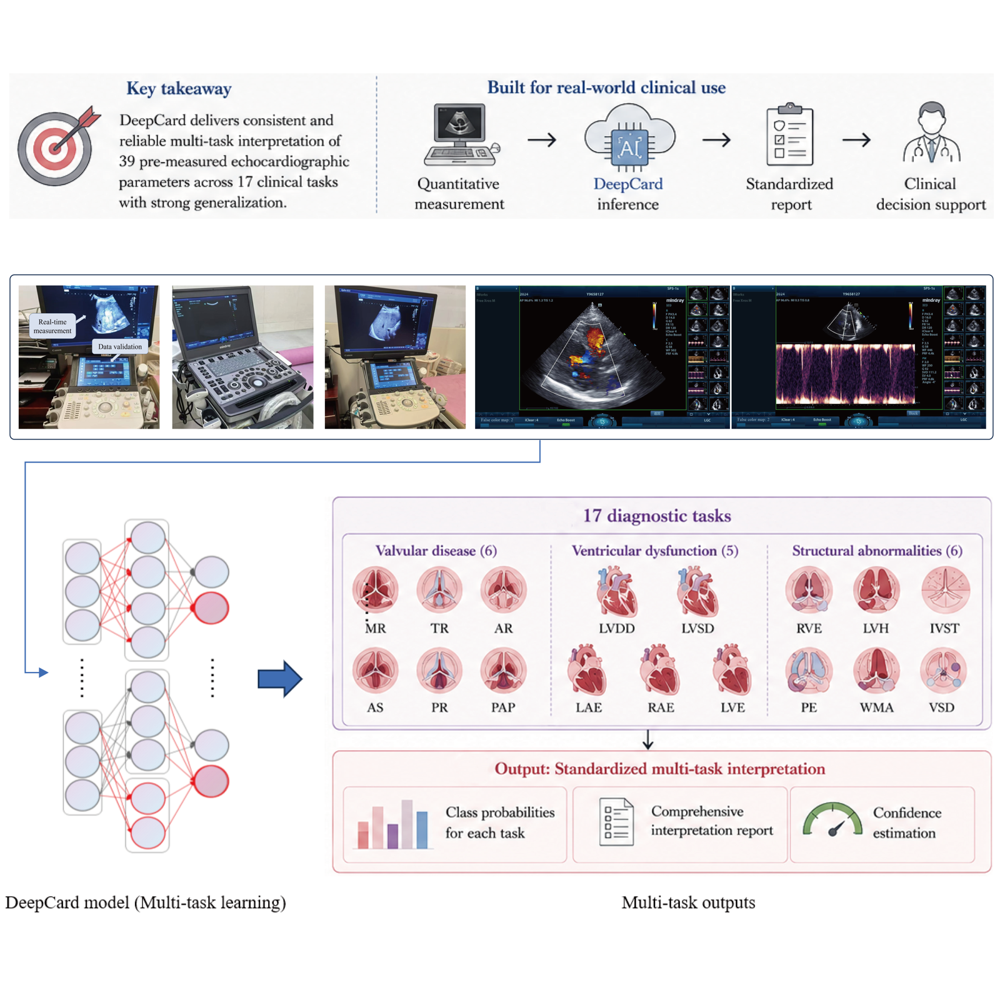
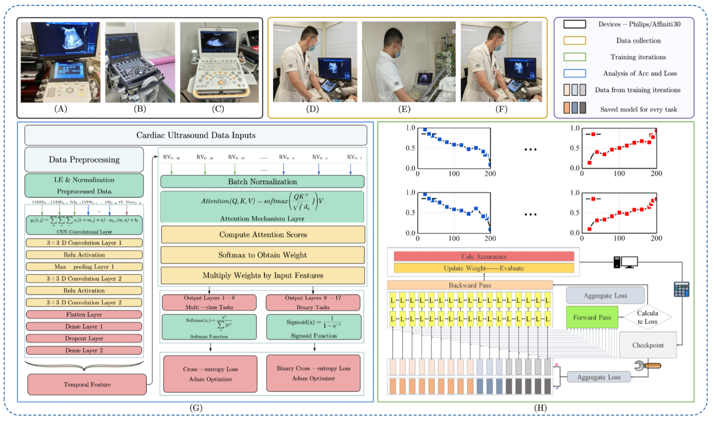
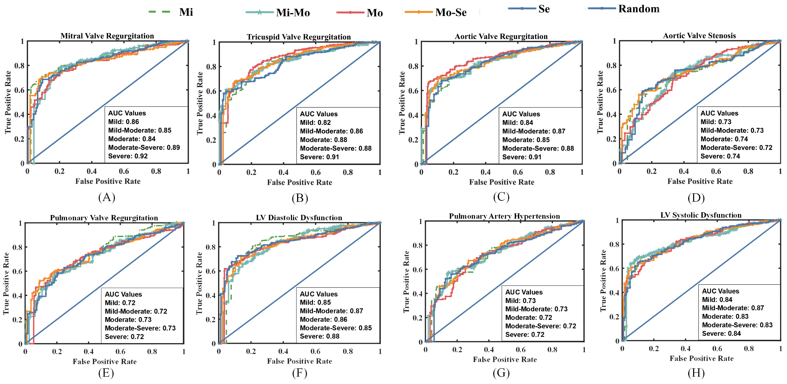
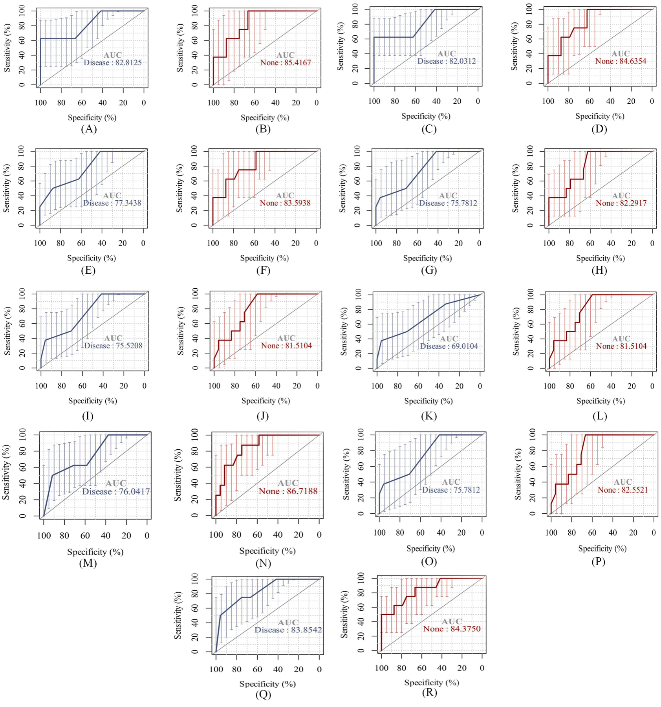
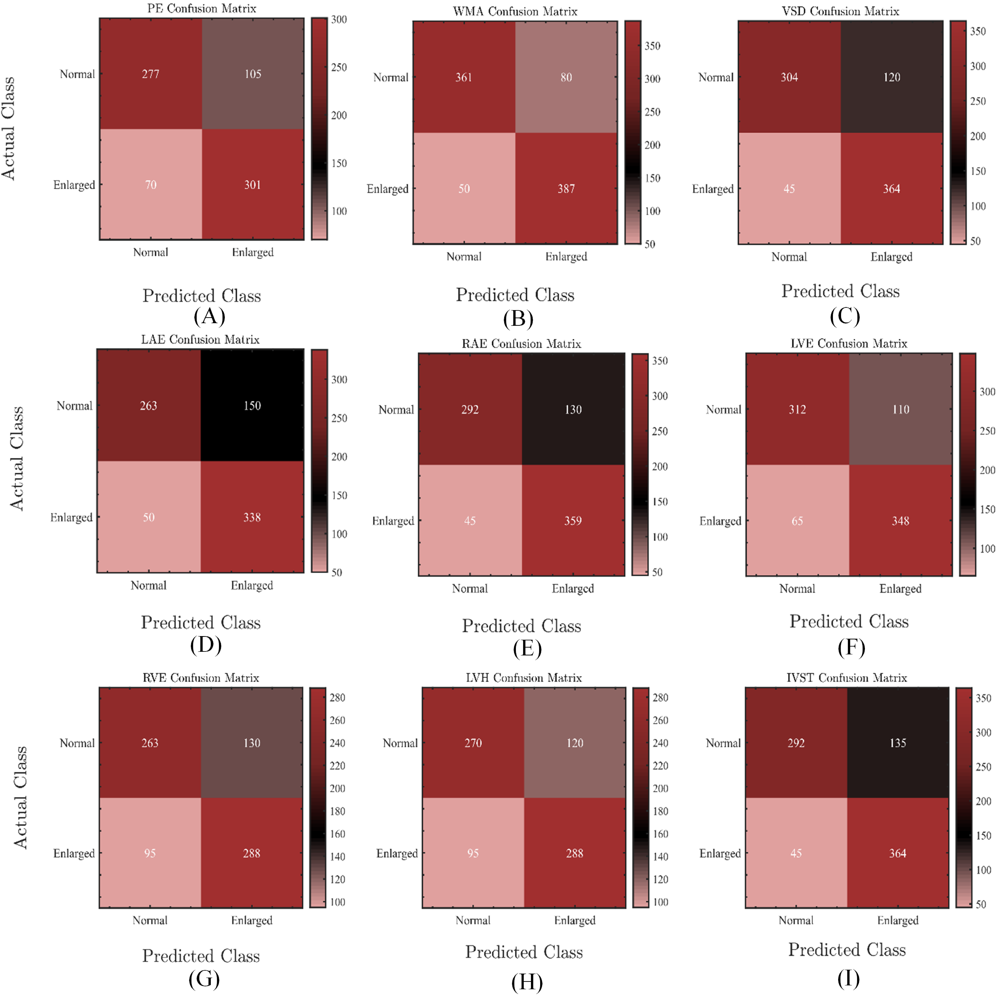
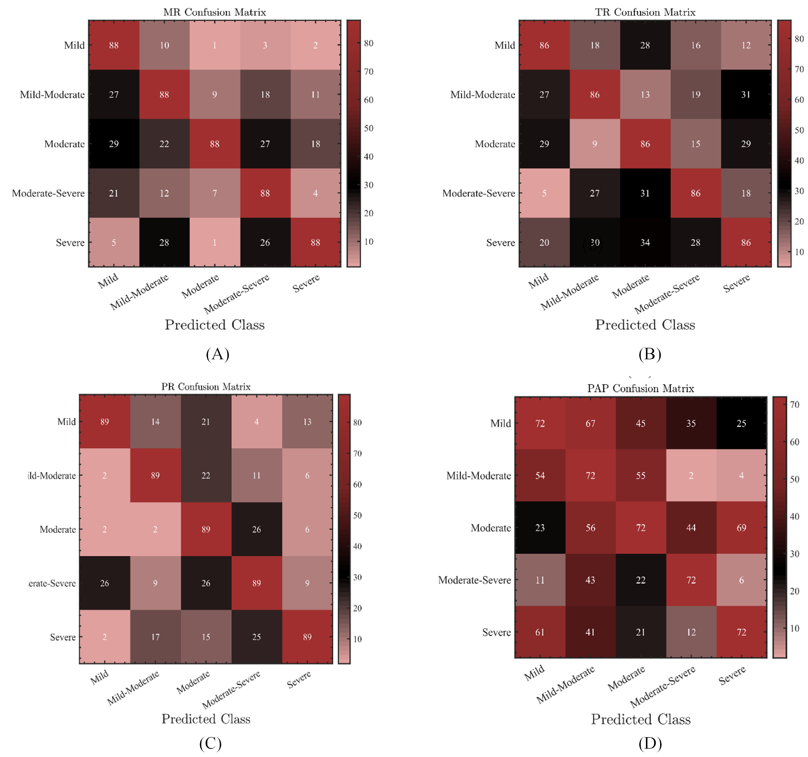
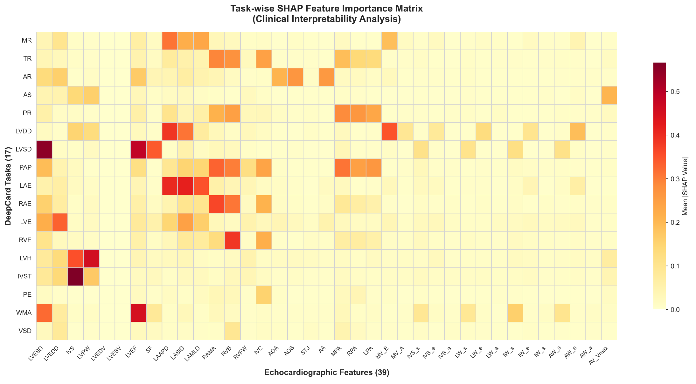
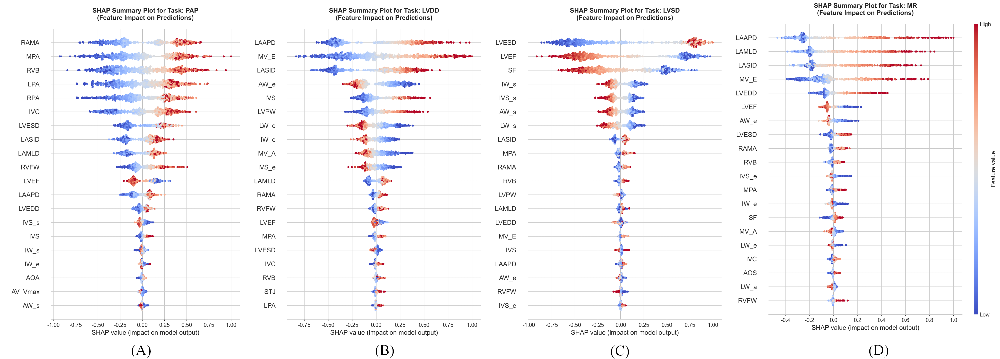

<div align="center">

# DeepCard

**Standardized multi-task interpretation of multiparameter cardiac ultrasound**

[](https://doi.org/10.1016/j.isci.2026.116904)
[](https://doi.org/10.1016/j.isci.2026.116904)
[](#task-space)
[](DeepCard)

<sub>39 measurements · 17 diagnostic tasks · multi-task learning · external validation</sub>

</div>

<p align="center">
  
</p>

DeepCard maps pre-measured echocardiographic parameters to standardized diagnostic interpretations, targeting the interpretation layer rather than image acquisition or automated caliper placement.

The model addresses a distinct source of variability in cardiac ultrasound: clinicians may reach different diagnostic interpretations even when working from the same standardized measurements. DeepCard therefore does not replace acquisition or measurement protocols. It learns a reproducible mapping from 39 quantitative parameters to 17 report-level endpoints spanning valvular disease, ventricular function, pressure estimates, chamber remodeling, and structural abnormalities.

Developed in collaboration with **PLA General Hospital**, DeepCard is positioned between quantitative echocardiographic measurement and final report interpretation. The project asks whether a single shared model can preserve the relationships among measurements while still respecting the different label structures of valvular severity, ventricular dysfunction, chamber enlargement, hypertrophy, effusion, wall-motion abnormality, and septal defect.

## Research overview

Echocardiography produces a structured but heterogeneous set of measurements. Two-dimensional dimensions, M-mode indices, Doppler velocities, pressure gradients, tissue-Doppler variables, and derived functional quantities describe different aspects of cardiac anatomy and physiology. In routine reporting, these measurements are interpreted jointly rather than in isolation. A change in one parameter may support several diagnoses, and the same diagnosis may depend on a combination of measurements.

This structure makes the task well suited to multi-task learning. A model for one endpoint can benefit from patterns learned for related endpoints, but excessive sharing can also cause negative transfer when tasks rely on different evidence. DeepCard uses a common residual encoder and attention layer to learn a cardiovascular representation, followed by endpoint-specific heads that preserve the output type and decision boundary of each task.

The project deliberately begins after measurement acquisition. It does not infer measurements from raw ultrasound video and does not replace sonographer quality control. Its purpose is to standardize the mapping from an already measured examination to a set of report-level diagnostic predictions. This distinction defines the evidence boundary: performance reflects interpretation of quantitative inputs and should not be presented as end-to-end ultrasound diagnosis from pixels.

## At a glance

<table align="center">
  <tr align="center">
    <th>Input</th><th>Shared representation</th><th>Outputs</th><th>Interpretation</th>
  </tr>
  <tr align="center">
    <td>39 quantitative<br>echo measurements</td>
    <td>Residual 1D CNN<br>+ attention</td>
    <td>8 multiclass<br>+ 9 binary tasks</td>
    <td>Task-wise<br>SHAP attribution</td>
  </tr>
</table>

<table align="center">
  <tr align="center">
    <th>Training cohort</th><th>Internal test</th><th>External cohort</th><th>External degradation</th>
  </tr>
  <tr align="center">
    <td><b>400 patients</b></td><td><b>100 patients</b></td><td><b>102 patients</b></td><td><b>2.6% mean</b></td>
  </tr>
</table>

## Task space

<table align="center">
  <tr align="center">
    <th>Valvular and pressure</th><th>Ventricular function</th><th>Structural findings</th>
  </tr>
  <tr align="center">
    <td>MR · TR · AR · AS · PR · PAP</td><td>LVDD · LVSD · LAE · RAE · LVE</td><td>RVE · LVH · IVST · PE · WMA · VSD</td>
  </tr>
</table>

The 17 endpoints are heterogeneous by design. Eight tasks use ordered severity categories and require the model to distinguish adjacent grades; nine tasks are binary findings in which class prevalence and false-negative behavior may dominate interpretation. Reporting one overall accuracy would obscure these differences. DeepCard therefore retains task-specific metrics, confidence intervals, ROC curves, and confusion matrices alongside the aggregate summary.

Abbreviations follow the project registry: MR, TR, AR, AS, and PR denote the principal valvular lesions; PAP represents pulmonary artery pressure assessment; LVDD and LVSD describe left-ventricular diastolic and systolic dysfunction; LAE, RAE, LVE, and RVE describe chamber enlargement; and the remaining tasks cover hypertrophy, septal thickness, pericardial effusion, wall-motion abnormality, and ventricular septal defect.

## Input representation

### Measurement harmonization

The input layer validates a 39-feature examination record before model inference. Each feature is associated with a stable name, unit, plausible numeric domain, and missing-value policy. This contract is important because clinically identical concepts can be stored under different labels or units across systems. A model cannot be meaningfully validated across centers if a diameter in millimeters is silently mixed with centimeters or if a missing Doppler measurement is interpreted as a physiologic zero.

Continuous measurements are normalized using statistics derived from the development data. Missingness is retained explicitly rather than hidden through undocumented replacement. The public schema and task registry separate data validation from model execution, allowing an examination to fail early when its feature set, units, or label structure is inconsistent with the trained model.

### Clinically ordered feature sequence

Although the input is tabular, DeepCard represents the measurements as an ordered one-dimensional sequence. Related chamber, valvular, Doppler, and functional measurements are placed in stable neighborhoods so that local convolutional filters can learn clinically meaningful interactions. Residual connections preserve lower-level measurement information as deeper layers form more abstract patterns.

The ordering is fixed before evaluation. It is not optimized using the test cohort. The ordering-ablation table included in the repository records how disrupting this structure changes performance, providing evidence that the sequence layout is part of the model specification rather than an incidental preprocessing choice.

## Model design

1. **Input standardization** — 2D, M-mode, Doppler, and tissue-Doppler measurements are normalized into a unified feature vector.
2. **Residual feature encoder** — one-dimensional convolutional blocks learn nonlinear interactions among quantitative measurements.
3. **Attention layer** — query–key–value weighting emphasizes task-relevant cardiac features in the shared representation.
4. **Multi-task heads** — softmax heads model disease severity; sigmoid heads model binary diagnostic endpoints.
5. **Joint optimization** — task-specific losses are aggregated while preserving a common cardiovascular representation.
6. **Explainable reporting** — calibrated probabilities and task-wise SHAP profiles support standardized interpretation.

### Shared representation with task-specific decisions

Residual 1D convolutional blocks form the principal feature encoder. They learn nonlinear combinations among adjacent measurements while shortcut connections stabilize optimization and preserve the original signal. The attention module then allows each encoded position to interact with the full measurement profile, which is useful when a diagnosis depends on variables located in different clinical groups.

The shared representation is passed to separate heads. Severity-graded endpoints use multiclass outputs, whereas binary structural findings use sigmoid outputs. This arrangement allows correlated tasks to share statistical strength while preserving task-specific probability spaces. Joint optimization aggregates the individual losses, but evaluation is performed for every endpoint so that a strong high-prevalence task cannot conceal poor performance on a rarer finding.

### Multi-task learning rationale

Several cardiovascular findings are physiologically related. Chamber enlargement may co-occur with valvular disease; pulmonary-pressure estimates interact with right-sided findings; and systolic or diastolic dysfunction is reflected in multiple measurements. A shared encoder can reuse these patterns instead of training 17 unrelated models.

At the same time, the system does not assume that every task should use the same features. Attention and task-specific heads permit different diagnostic outputs to emphasize different parts of the measurement vector. The SHAP analysis is therefore organized as a task-by-feature map, making it possible to inspect whether the model uses task-appropriate evidence rather than one generic ranking for all predictions.

## Architecture

DeepCard treats quantitative echocardiographic measurements as a clinically ordered sequence. A residual 1D encoder and attention layer build a shared representation, while task-specific heads produce eight severity-graded and nine binary diagnostic outputs.

The feature sequence preserves clinically meaningful neighborhoods among chamber dimensions, Doppler measurements, valve-related variables, and functional indices. Residual convolutional blocks capture local interactions, attention redistributes emphasis across the full measurement profile, and separate softmax or sigmoid heads match the label structure of each endpoint. Joint optimization then allows correlated tasks to share statistical strength without forcing them to use identical decision boundaries.

<p align="center">
  <br>
  <sub>Figure 4. Measurement standardization, shared representation, and multi-task optimization.</sub>
</p>

### Inference pathway

An examination passes through four explicit stages. First, the input contract checks feature identity, units, range, and missingness. Second, the standardized 39-dimensional vector is encoded through residual convolutional layers. Third, attention redistributes information across the representation. Fourth, the appropriate task heads generate probability vectors or binary probabilities for the 17 endpoints.

The output is a structured multi-task record rather than one undifferentiated label. Each prediction retains its task identity, probability distribution, decision threshold, and evaluation metadata. This structure supports endpoint-level reporting and prevents probabilities from tasks with different class definitions from being pooled incorrectly.

### Explanation pathway

Global SHAP summaries quantify how strongly each measurement contributes across the evaluation cohort for a given task. Local views retain the sign and magnitude of patient-level attributions. Together they answer two different questions: which measurements does the model use consistently, and why did the model assign a particular probability to one examination?

These explanations are descriptive of the fitted model. They do not establish that an attributed measurement causes the predicted condition, and they do not validate the underlying measurement. A clinically implausible attribution may indicate model error, an out-of-distribution examination, correlated inputs, or a measurement-quality problem and should prompt review rather than automatic acceptance.

## Results

<table align="center">
  <tr align="center">
    <th>Validation</th><th>Sensitivity</th><th>Precision</th><th>F1</th><th>Accuracy</th>
  </tr>
  <tr align="center"><td>Internal</td><td><b>0.77</b></td><td><b>0.74</b></td><td><b>0.75</b></td><td><b>0.77</b></td></tr>
  <tr align="center"><td>External · n=102</td><td><b>0.75</b></td><td><b>0.72</b></td><td><b>0.73</b></td><td><b>0.75</b></td></tr>
</table>

### Internal and external validation

The internal test set comprised 100 patients, and generalization was assessed in an independent 102-patient cohort from a separate medical center. Mean sensitivity, precision, F1, and accuracy changed from 0.77, 0.74, 0.75, and 0.77 internally to 0.75, 0.72, 0.73, and 0.75 externally. The mean decline in sensitivity across the 17 endpoints was 2.6%.

Performance did not transfer uniformly across tasks. Common valvular and ventricular endpoints retained relatively stable estimates, whereas lower-prevalence structural findings showed wider confidence intervals and should be interpreted more cautiously. The repository therefore reports endpoint-level results and confidence intervals rather than relying only on a single macro average.

<table align="center">
  <tr align="center"><th>Clinical endpoint</th><th>Published result</th></tr>
  <tr align="center"><td>Valvular assessment</td><td><b>91% specificity</b></td></tr>
  <tr align="center"><td>Ventricular evaluation</td><td><b>82% accuracy</b></td></tr>
  <tr align="center"><td>Inter-observer variability</td><td>Reduced to <b>13.4%</b></td></tr>
  <tr align="center"><td>External mitral regurgitation</td><td>Sensitivity <b>0.85</b> · Specificity <b>0.89</b> · F1 <b>0.84</b></td></tr>
</table>

### Multiclass severity discrimination

Severity-specific ROC curves show how discrimination changes from mild to severe disease across eight graded endpoints. Performance is strongest for clinically advanced valvular disease while remaining stable across ventricular-function grades.

For mitral, tricuspid, and aortic regurgitation, the severe categories reached AUCs of 0.92, 0.91, and 0.91, respectively. Left-ventricular diastolic dysfunction remained between 0.85 and 0.88 across severity levels, while systolic dysfunction ranged from 0.83 to 0.87. Presenting the full set of class-specific curves makes it possible to distinguish strong severe-disease discrimination from the more difficult separation of adjacent mild and moderate grades.

<p align="center">
  <br>
  <sub>Figure 5. Multiclass ROC analysis for severity-graded endpoints.</sub>
</p>

### Binary disease discrimination

Nine binary tasks cover chamber enlargement, hypertrophy, effusion, wall-motion abnormality, and septal defect. Class-wise confidence bands expose both discrimination and uncertainty for the presence and absence of each finding.

For example, left-atrial enlargement achieved an AUC of 0.82 for disease detection and 0.85 for exclusion, while pericardial-effusion detection reached an AUC of 0.76. These curves should be read together with disease prevalence and interval width: endpoints with fewer positive observations can show apparently acceptable point estimates while retaining greater statistical uncertainty.

<p align="center">
  <br>
  <sub>Figure 6. Binary ROC curves with 95% confidence intervals.</sub>
</p>

### Error structure

Confusion matrices complement aggregate metrics by showing where errors occur within each endpoint. Binary matrices expose class imbalance and false-negative patterns; multiclass matrices show whether errors remain close to the neighboring severity grade.

This distinction matters for clinical interpretation. A one-grade error between adjacent severity categories is not equivalent to confusing a normal examination with severe disease, and a false negative in a low-prevalence structural endpoint has a different implication from a false positive. The full matrices preserve these task-specific error structures rather than compressing them into a single accuracy value.

<p align="center">
  <br>
  <sub>Figure 7. Confusion matrices for the nine binary endpoints.</sub>
</p>

<p align="center">
  <br>
  <sub>Figure 8. Confusion matrices for representative severity-graded endpoints.</sub>
</p>

### Task-wise interpretation

Global SHAP importance identifies the measurements consistently used across diagnostic tasks. The task-by-feature heatmap preserves differences between valvular, functional, and structural endpoints instead of collapsing interpretation into a single ranking.

The resulting attribution structure is clinically heterogeneous. Pressure-related predictions emphasize right-sided and pulmonary vascular measurements; diastolic dysfunction places greater weight on left-atrial size and filling parameters; systolic dysfunction is driven by global functional markers such as LVEF and LVESD. This pattern shows that the shared encoder does not reduce all tasks to the same generic feature profile.

<p align="center">
  <br>
  <sub>Figure 10. Global task-wise feature attribution.</sub>
</p>

Local SHAP profiles provide a more detailed view for representative tasks, linking the direction and magnitude of individual measurements to each model output.

Each point represents one patient-level attribution, so the plots show both the global ordering of important variables and the direction in which high or low measurements shift a prediction. The local views are intended as model-behavior evidence rather than causal explanations: they clarify which standardized measurements influenced the output, but they do not establish that changing a measurement would change the underlying disease state.

<p align="center">
  <br>
  <sub>Figure 11. Local attribution profiles for four representative tasks.</sub>
</p>

Published tables: [task metrics with confidence intervals](results/disease_performance_with_ci.csv) · [external validation](results/internal_external_validation.csv) · [baseline benchmark](results/baseline_benchmark.csv) · [ordering ablation](results/ordering_ablation.csv)

## Evaluation design

### Internal holdout

The development study separates model fitting from a 100-patient internal test cohort. Performance is calculated at the endpoint level before macro or mean summaries are formed. For multiclass tasks, class-specific ROC curves and confusion matrices show how discrimination changes across severity grades. For binary tasks, sensitivity, specificity, precision, F1, and ROC behavior characterize both positive-case detection and false-positive burden.

The mean internal sensitivity, precision, F1, and accuracy are 0.77, 0.74, 0.75, and 0.77. These aggregate values summarize a broad task set but do not imply identical reliability across all 17 outputs. The result tables therefore retain endpoint-specific estimates and confidence intervals, especially for lower-prevalence structural findings whose uncertainty is larger.

### Independent external cohort

Generalization is evaluated in an independent 102-patient cohort from another medical center. Mean sensitivity, precision, F1, and accuracy are 0.75, 0.72, 0.73, and 0.75, representing a mean sensitivity decline of 2.6 percentage points across the task set. This external comparison is important because measurement distributions, reporting conventions, disease prevalence, equipment, and acquisition practice can differ across centers even when the nominal feature list is the same.

The external results should be interpreted as one independent transfer assessment, not as proof of universal portability. A small mean decline can coexist with larger changes for individual tasks. Future deployments should therefore repeat unit harmonization, prevalence review, threshold calibration, and endpoint-level validation in the intended setting.

### Baseline and representation analysis

The repository includes a machine-readable baseline benchmark and an ordering ablation. These comparisons address two questions: whether the proposed shared architecture improves over alternative modeling strategies, and whether the clinically ordered representation contributes beyond using the same measurements as an unordered vector.

Fair comparison requires identical patient splits, preprocessing, label definitions, and evaluation code. The public result tables preserve the reported comparisons, while the documentation specifies the data and experiment contracts needed for a complete reproduction. Apparent improvements should not be generalized to a new cohort until the same protocol is rerun with its own data-quality checks.

## Reading the result figures

The graphical abstract summarizes the full workflow from standardized measurements to multi-task interpretation. The architecture figure explains how the shared encoder and task-specific heads are connected. ROC figures emphasize discrimination; confusion matrices reveal the clinical distance and direction of errors; and SHAP figures describe which measurements support the fitted decisions.

These figures are intentionally positioned beside their corresponding interpretation rather than collected into a gallery. The multiclass ROC panel should be read together with severity support. The binary ROC panel should be read together with prevalence and interval width. Confusion matrices should be inspected for adjacent-grade errors versus clinically distant errors. Attribution plots should be assessed for physiologic plausibility without being mistaken for causal evidence.

## Research contribution

DeepCard's central contribution is the formulation of standardized echocardiographic interpretation as a heterogeneous multi-task problem. The project moves beyond one-disease classification by representing 17 related diagnostic outputs within a shared architecture, while preserving the distinction between graded and binary endpoints.

The second contribution is methodological separation of measurement and interpretation. Because inputs are pre-measured quantities, the study can evaluate interpretive consistency without conflating it with image-acquisition and automated-measurement errors. This makes the intended use and the model's limitations easier to state precisely.

The third contribution is task-aware interpretability. A single global feature ranking would be insufficient for a model that spans valve disease, pressure, ventricular function, chamber remodeling, and structural abnormalities. The task-by-feature and local explanation views reveal how the shared representation is specialized by each output head.

## Scope and limitations

DeepCard depends on the quality and completeness of the measurements supplied to it. It cannot correct an incorrectly placed caliper, poor Doppler alignment, an omitted view, or a measurement produced outside the validated protocol. It should therefore be used only after standard echocardiographic acquisition and quality control.

The cohort sizes are limited relative to the breadth of the 17-task label space, and rare findings may have wide uncertainty. External validation is based on one additional cohort; broader evaluation across centers, devices, populations, and reporting practices remains necessary. Shifts in disease prevalence may also change predictive values even when sensitivity and specificity remain similar.

The model supports standardized research interpretation and reporting assistance. It is not a substitute for physician review and is not presented as a stand-alone diagnostic device. The public repository exposes the existing lightweight implementation, validated contracts, evaluation utilities, result tables, and documentation, but it does not redistribute the underlying clinical dataset.

## Codebase blueprint

```text
Deepcard/
├── assets/                         # graphical abstract, architecture, result figures
├── results/                        # machine-readable published tables
├── DeepCard/
│   ├── config.py                   # experiment configuration
│   ├── data.py                     # tabular data ingestion
│   ├── feature_engineering.py      # measurement preprocessing
│   ├── model.py                    # shared encoder and task heads
│   ├── losses.py                   # multi-task objectives
│   ├── train.py                    # training workflow
│   ├── evaluate.py                 # performance evaluation
│   ├── interpret.py                # SHAP analysis
│   ├── run_train.py                # training entry point
│   ├── run_evaluate.py             # evaluation entry point
│   ├── configs/                    # modular configuration scaffold
│   ├── datasets/
│   │   ├── schemas/                # measurement and label schemas
│   │   ├── transforms/             # preprocessing components
│   │   └── splits/                 # internal and external manifests
│   ├── models/
│   │   ├── backbones/              # residual 1D encoders
│   │   ├── attention/              # shared attention blocks
│   │   └── heads/                  # multiclass and binary heads
│   ├── training/
│   │   ├── losses/                 # task weighting and objectives
│   │   ├── optimizers/             # schedules and optimization
│   │   └── callbacks/              # checkpoints and early stopping
│   ├── evaluation/
│   │   ├── internal/               # holdout evaluation
│   │   ├── external/               # cross-center validation
│   │   └── calibration/            # confidence analysis
│   ├── explainability/             # task-wise feature attribution
│   ├── reporting/                  # standardized output generation
│   └── tests/
│       ├── unit/
│       └── integration/
└── README.md
```

The existing lightweight implementation is preserved and now complemented by validated 39-feature/17-task contracts, dependency-light evaluation metrics, a canonical task registry, structured reporting utilities, unit tests, and CI. Training still requires the dependencies and private data described in `DeepCard/requirements.txt` and `DeepCard/DATA_FORMAT.md`.

<details>
<summary><b>Citation</b></summary>

```bibtex
@article{wen2026deepcard,
  title   = {A Deep Learning Framework for Standardized Interpretation of Multiparameter Cardiac Ultrasound and Disease Classification},
  author  = {Wen, Zhihong and Liu, Xiangpeng and Liu, Yi and Tang, Wenbo and An, Kang and Guo, Shengli},
  journal = {iScience},
  volume  = {29},
  number  = {8},
  pages   = {116904},
  year    = {2026},
  doi     = {10.1016/j.isci.2026.116904}
}
```

</details>
